# MLR-Dx: Machine Learning based Radar Detection Experiment  

**AiR-Dx** is a lightweight, noise-resilient convolutional neural network (CNN) framework for classifying radar Doppler spectrograms of airborne objects such as:
- 🐦 Bird Flocks
- ✈️ Drone Swarms
- 🛸 Stealth UAVs

This project aims to deliver high-accuracy classification under varying noise levels with GRAD-CAM visualizations to help increase trust and explainability of the models. The aim is also to keep the model small enough for potential deployments on edge AI devices. 

⚡ <strong>TL;DR</strong>: A lightweight custom CNN model that classifies radar Doppler spectrograms into bird flocks, drone swarms, and stealth UAVs. It outperforms ResNet under noisy conditions and offers interpretability via Grad-CAM. Designed for real-time and edge deployment scenarios.

### Features 
The project includes the following features to achieve the desired results:
- 🔊 Synthetic Doppler spectrogram generation for simulated dataset
- ✅ Simple yet effective custom CNN architecture (only 4 convolutional layers!)
- 📈 High accuracy and robustness under noisy conditions
- 🔍 Evaluation metrics including confusion matrix, F1, precision, recall
- 🧪 ResNet baseline included for comparison
- 🔥 Grad-CAM visualization for interpretability to understand where the CNN "looks"
- 📦 Exportable as pre-trained `.pth` model for deployment

---

### Table of Contents
- [💡 Motivation](#motivation)
- [👋 Introduction](#introduction)
- [🧪 Experimental Setup](#experimental-setup)
- [📊 Results](#results)
- [🔍 Explainability](#explainability)
- [🛠️ Project Structure](#project-structure)
- [🔮 Future Work](#future-work)
- [✉️ Reach Out](#reach-out)

### Motivation

Modern radar systems face a growing challenge of distinguishing between aerial vehicles in real-time, often under noisy conditions while faced with new challenges such as stealth aircrafts, bird flocks and drone swarms. Whether it's protecting airspace from unauthorized UAVs or minimizing false alarms in bird-rich environments, robust radar classification is a pressing need both in defense and civilian applications.

At the same time, Doppler spectrograms encode motion-based information that traditional rule-based systems struggle to fully exploit. Applying state-of-the-art machine learning techniques to these spectrograms can unlock new levels of classification accuracy and robustness. Furthermore, since existing systems are brittle and prone to fail under noisy conditions, a lightweight and noise-resilient model can significantly enhance the reliability of radar systems in real-world scenarios. 

In short: this work combines signal processing intuition with machine learning to take a small but meaningful step toward smarter radar systems.

### Introduction 

Doppler effect refers to the change in frequency from the source to a relative destination. In the context of radar signals, the Doppler effect allows the radar to realize how different parts of a target object is moving. This could be wing flaps from birds or rotor hums from drone. 

This effect can be observed using a Doppler spectrogram, which is a diagram with:
- `x-axis`: representing time
- `y-axis`: representing the frequency or the Doppler shift. 
- `color`: representing the amplitude of the signal at that frequency and time.
<!-->TODO: Add an example of singal to Doppler spectrogram<!--->

This project aims to treat these Doppler spectrograms as images to classify radar targets even in noisy environments. The simulated Doppler signatures are divided into three classes: Bird flocks, Drone swarms and Stealth UAVs. These classes are chosen carefully:
 -  Bird flocks are very abundant in radar signal returns and large flocks moving at similar speeds are easily recognizable in Doppler spectrograms. The flapping of wings can modulate the Doppler return, creating periodic micro-Doppler components.
 -  Drone swarms often have multiple independently moving elements, each generating distinct Doppler returns. 
 -  Stealth UAVs are chosen and show up in spectrograms with very low signal strength. Stealth UAVs have geometries and materials that reduce RCS, making radar returns weak and often buried in noise.  

This project uses a custom CNN architecture to classify these spectrograms, achieving high accuracy and F1 score. The model is designed to be lightweight and robust. The CNN architecture is small in size and has only ~6M params (compared to Resnet18's ~12M). 

The model is then tested against various noise levels to ensure it can handle real-world conditions. The model was tested against noise levels by adding gaussian noise.The results show that the model maintains high accuracy even with significant noise, making it suitable for deployment in noisy environments.

The project also includes Grad-CAM visualization to interpret the model's decisions, helping to understand which parts of the spectrograms are most influential for classification. This is crucial for building trust in AI systems, especially in safety-critical applications like radar detection.

### Experimental Setup 

The project was tested using a synthetic dataset of Doppler spectrograms generated from simulated radar signals. 400 samples were generated for each class so that the model has enough visibility of the different classes. The dataset was split into training, validation, and test sets with a 80-20 ratio. The model was trained using the training set and evaluated on the validation set. The model with the highest validation accuracy was saved.

The model architecture consists of four convolutional layers, each followed by ReLU activation. The final layer is a fully connected layer that outputs the class probabilities. The model was designed to be lightweight, with only ~6 million parameters and is only ~7MB in size making it a strong candidate for deployment on edge devices. The model architecture is shown below:

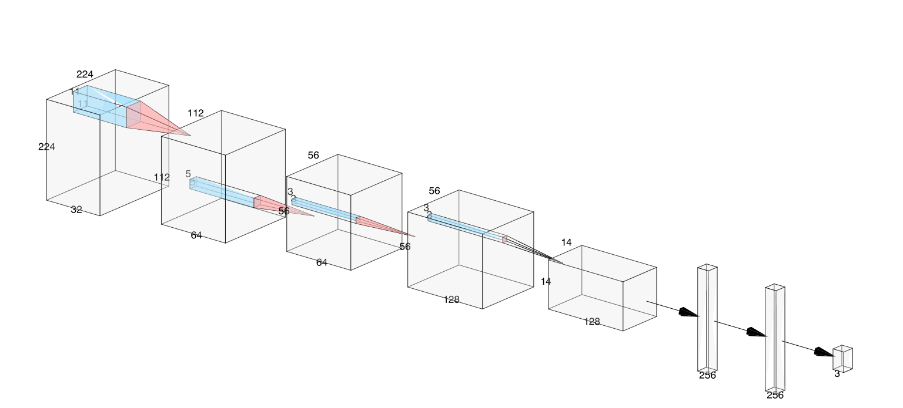

<b>Figure 1:</b> CNN model architecture

Each simulated spectrogram had varying frequency and amplitude characteristics to mimic real-world radar returns. The model was trained for 15 epochs with a batch size of 8, using the Adam optimizer and a learning rate of 0.001. The training process included data augmentation techniques that are relevant to Doppler spectrograms, such as random rotation and flipping, to improve the model's robustness. The input image size was `224 x 224`.

The following figure shows the training and validation accuracy over epochs, demonstrating the model's learning curve.

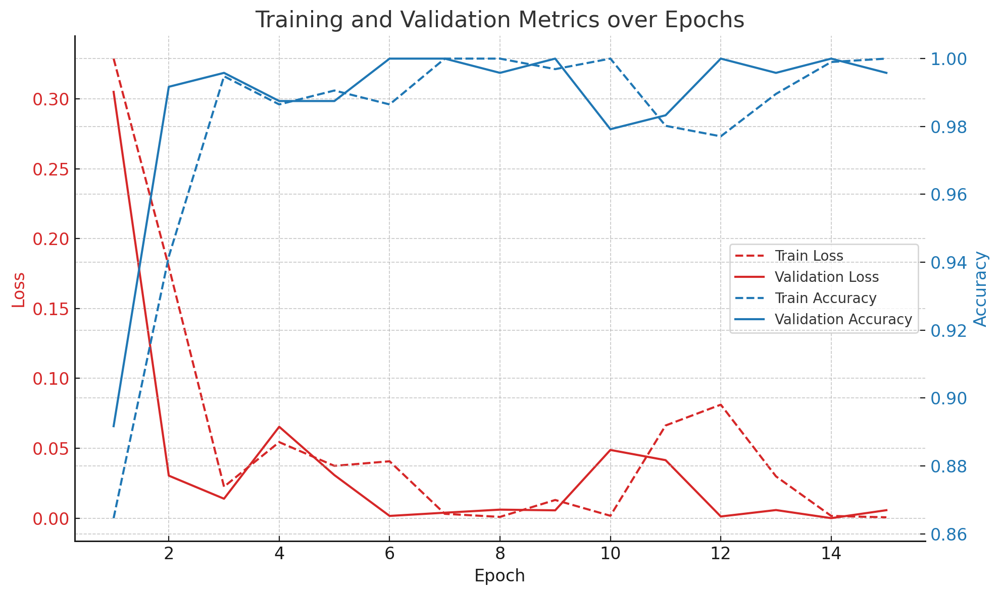

<strong>Figure 2:</strong> Model Accuracy vs Epochs for CNN Classifier

A baseline Resnet (resnet-18) was also trained to compare the results relative to the trained CNN.

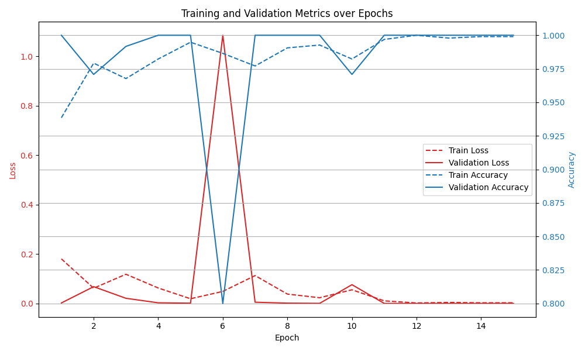
 
<strong>Figure 3:</strong> Model Accuracy vs Epochs for Resnet18 Classifier

After training both models on the same dataset, we used a newly generated test set to evaluate their performance. The test set consisted of 50 samples per class, ensuring a balanced evaluation across all classes. The models were evaluated using metrics such as accuracy, F1 score, precision, and recall. The confusion matrix was also generated to visualize the model's performance across different classes.

Since, under realistic conditions noise is a significant hindrance for radar systems, both models were also tested against various noise levels. The test set was overlayed with gaussian noise at levels: `1.0`, `1.2`, `1.4`, and `1.5`. Both models' performances were evaluated under these noisy conditions for a comparative analysis. 

To visualize and interpret the model's decisions, Grad-CAM was used to generate heatmaps that highlight the most influential regions in the spectrograms for classification. This helps in understanding how the model makes decisions and which features it focuses on, both with and without noise. 

### Results 

The custom CNN model achieved  an F1 score of 0.986, precision of 0.987, and recall of 0.987. The confusion matrix below shows the model's performance across different classes, indicating that the model is highly effective at distinguishing between bird flocks, drone swarms, and stealth UAVs.

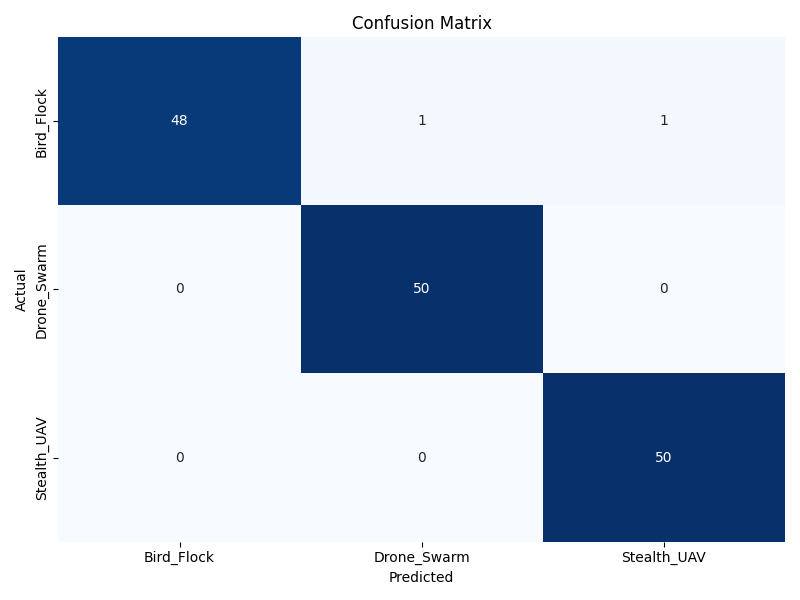

<strong>Figure 4:</strong> CNN classifier metrics vs Noise Level

The Resnet model achieved an F1 score of 0.814, precision of 0.866, and recall of 0.820. The confusion matrix below shows the model's performance across different classes, indicating that the model is relatively less effective at distinguishing between bird flocks and other classes (i.e. drone swarms, and stealth UAVs).

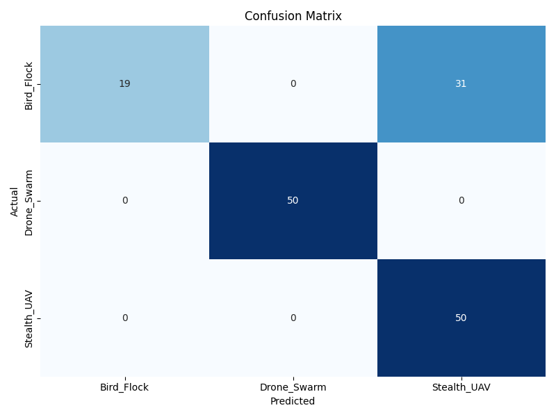

<strong>Figure 5:</strong> Resnet classifier metrics vs Noise Level

Thus, the deduction from this finding is that the custom CNN model outperforms the Resnet baseline in terms of F1 score, precision, and recall. The custom CNN is more effective at distinguishing between the three classes, especially under noisy conditions. A potential reason for this could be the custom architecture's ability to focus on relevant features in the spectrograms, while the Resnet model may have been too complex for the dataset, leading to overfitting. This is also apparent from the high validation accuracy and low F1 score. 

Both models were then tested with noisy parameters with a newly generated test set. The loss in accuracy over the increase in the noise is shown in the figure below.

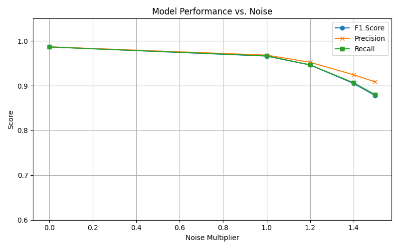
 
<strong>Figure 6:</strong> CNN classifier metrics vs Noise Level

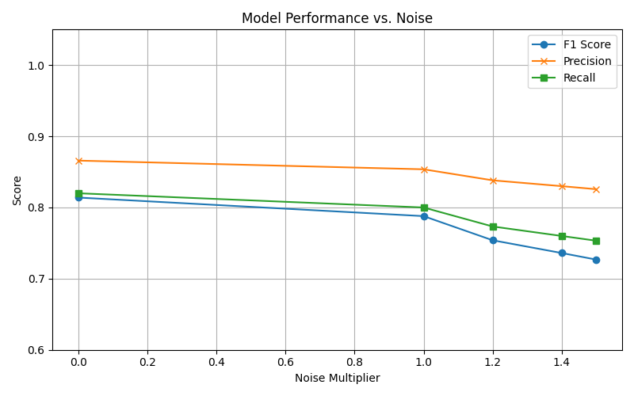

<strong>Figure 7:</strong> Resnet 18 metrics vs Noise Level

For the custom CNN model, the accuracy dropped from 0.986 to 0.878 at noise level 1.5, while the Resnet model dropped from 0.82 to 0.72 showing that the custom CNN is more robust to noise compared to the Resnet model. 

This indicates that the custom CNN model works particularly well even under high noise conditions. The custom CNN's architecture, with its fewer parameters and simpler design, allows it to generalize better under noisy conditions, while the Resnet model's complexity leads to a more significant drop in performance.

### Model Explainability (Grad-CAM) 

We utilized Grad-CAM to view what the model was "looking" at for different classes and noise levels. Grad-CAM generates heatmaps that highlight the most influential regions in the spectrograms for classification. This helps in understanding how the model makes decisions and which features it focuses on, both with and without noise.

For simpler inference, with no noise introduced to the test sample. It can be seen that the model looks at the signal and does not let the surrounding inherent noise to effect its decision.

  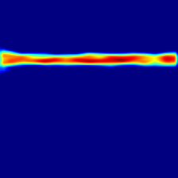
  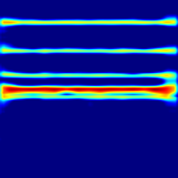
  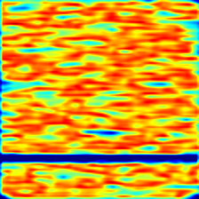
  

  <b>Figure 8:</b> Grad-CAM visualization for all classes (Bird Flocks, Drone Swarm, Stealth UAV)

These visualizations show that the CNN classifier is focusing on the right regions of the spectrogram to understand what the class is actually showing. 

For higher noise levels, the CNN looks in similar positions, but due to high SNR, the signal gets attenuated and the confidence of the model decreases.

  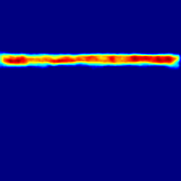
  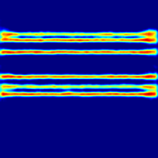
  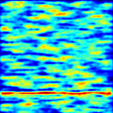
  

  <b>Figure 9:</b> Grad-CAM visualization for all classes under higher noise(Bird Flack, Drone Swarm, Stealth UAV)

The key takeaway from these visualizations is that the CNN model is able to focus on the relevant features in the spectrograms, even under noisy conditions. This is crucial for building trust in AI systems, especially in safety-critical applications like radar detection.

### Project Structure 

At the root of the project, you will find the following directories and files:

- `data/`: Contains the synthetic dataset of Doppler spectrograms.
- `out/`: Contains the custom CNN model definition and ResNet baseline and metrics.
- `test/`: Contains the data that the model was tested on
- `src/`: Contains the main code for training, evaluation, and visualization.
  - `generate_spectrograms.py`: Script to generate synthetic Doppler spectrograms.
  - `data_loader.py`: Handles dataset loading and preprocessing.
  - `model.py`: Defines the custom CNN architecture.
  - `resnet.py`: Contains the ResNet baseline model.
  - `training.py`: Main training loop and evaluation logic.
  - `utils.py`: Utility functions for metrics and visualization.
  - `inference.py`: Script for running inference on new data.

### Future Ideas 
This project is a starting point for building more robust radar detection systems. Here are some ideas for future work:
  - Pruning and quantization of the model to reduce size and improve inference speed on edge devices.
  - Expanding the problem to a multi-class multi-label classification where a single spectrogram can have multiple classes (e.g. bird flock and drone swarm).
  - Applying similar approaches to other signal processing tasks, such as CIR in wireless communication or audio classification.

### Reach Out 
If you have any questions, suggestions, or feedback, feel free to reach out <a href="mailto:shaiq.e.mustafa@gmail.com">here</a>
